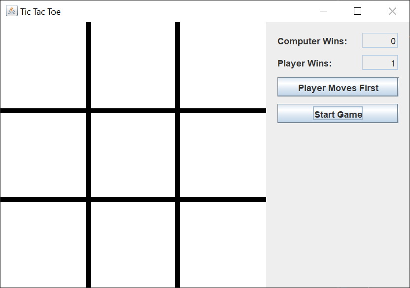
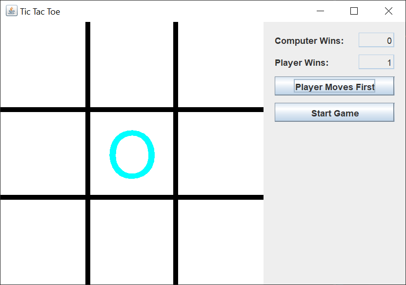
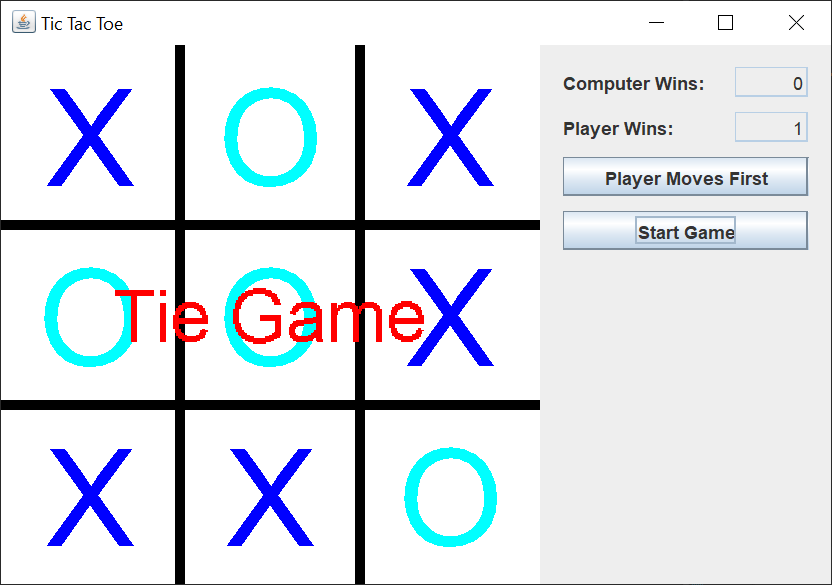

# Tic-Tac-Toe

## Introduction

About six years ago, I created a Java Swing tic-tac-toe game.  You'd think this would be a simple game to implement.  You'd be wrong.

Here are three images of the Swing GUI.  Here's what the game looks like when you start the GUI.

The Player Moves First button is a toggle button.  If you left-click the button, the button text changes to Computer Moves First.  If you left-click the button again, the button text changes back to Player Moves First.

The Start Game button lets you start a game.

Here's what the game looks like when the computer starts a game.  I'd toggled the Computer Moves First button back to Player Moves First when I snapped the picture.

Here's what the game looks like when the game is finished.

## Explanation

If you’re not familiar with Java Swing, Oracle has an excellent tutorial to get you started, [Creating a GUI With JFC/Swing](https://docs.oracle.com/javase/tutorial/uiswing/index.html). Skip the Netbeans section.

When I create a Swing GUI, I use the [model / view / controller](https://en.wikipedia.org/wiki/Model%E2%80%93view%E2%80%93controller) (MVC) pattern.  This pattern allows me to separate my concerns and focus on one part of the Swing application at a time.

When creating a Java Swing application, the MVC pattern means:

1. The view reads information from the model.
2. The view may not update the model
3. The controller updates the model and revalidates / repaints the view.

Usually in Swing, the action classes are the controller classes.  There's usually no one controller class to "rule them all".  Each action class controls it's own function independently from the other action classes.

The tic-tac-toe Swing application has one model class, four view classes, and two controller classes.  There is also a class to start the application and an enum that gives the values for the game status, for a total of nine classes.

### Model

The TicTacToe model class is a plain Java getter / setter class that holds a boolean to say whether the player or the computer goes first, the int score for the player and the computer, the board state in a two-dimensional int array, and the game status.

### View

The Swing tic-tac-toe GUI counsists of one JFrame, a control JPanel to hold the scores and JButtons, and a drawing JPanel to hold the tic-tac-toe game board.  There's also a game over image that appears over the tic-tac-toe board when the game ends.

The control JPanel uses a GridBagLayout to layout the scores and JButtons.  The drawing JPanel draws the board and moves based on the information from the model.

### Controller

The two controller classes consist of a Runnable that makes the computer's moves and a MouseAdapter that responds to the player's left-clicks on the game board.  The computer move Runnable is probably over-complicated and could be generalized.  When I wrote this, I was more interested in illustrating a Swing drawing JPanel than figuring out the logic behind the game. 
